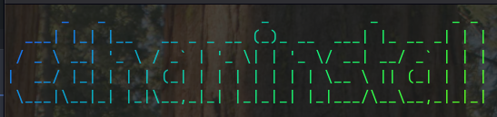

# ethaninstall

a tool to use when install **arch linux** for ethan, you clone this repo and then cd and run it!

supported systems:
- arch linux 
- endeavouros 
- steamos
- artix linux
- cachyos
- omarchy
- manjaro